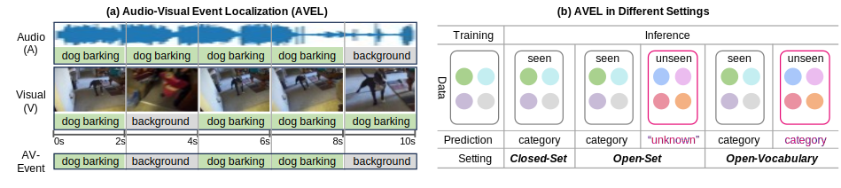

# Towards Open-Vocabulary Audio-Visual Event Localization


Jinxing Zhou, Dan Guo, Ruohao Guo, Yuxin Mao, Jingjing Hu, Yiran Zhong, Xiaojun Chang, Meng Wang

Official code for our CVPR 2025 paper: [Towards Open-Vocabulary Audio-Visual Event Localization](https://arxiv.org/abs/2411.11278)


## Introduction
In this paer, we propose Open-Vocabulary Audio-Visual Event Localization (OV-AVEL) task, aiming to localize both seen and unseen audio-visual events in test videos. To the best of our knowledge, this work is the first to advance the AVEL area toward more practical applications in open-vocabulary scenarios. To facilitate this new task, we construct the OV-AVEBench dataset, which includes segment-level manual event annotations. Besides, we establish standard evaluation metrics that encompass typical accuracy, as well as segment-level and event-level F1-scores. We propose two simple baselines: one adopting a training-free paradigm, which can be upgraded through further fine-tuning on available training data. We hope that our benchmark will inspire future research in this field. 



## Data Preparation

### Dataset

The proposed OV-AVEBench dataset is available now. You may directly download the preprocessed audio (.wav) and visual (.png) files from [this link](https://mailhfuteducn-my.sharepoint.com/:u:/g/personal/2018110964_mail_hfut_edu_cn/Ef9AH0VrrVFGlocbYQUiFpEBa-afOfGFDuctUhCQqVKFDw?e=PiQwOT) to develop your own models for OV-AVEL task.  The raw videos are also available at [here](https://mailhfuteducn-my.sharepoint.com/:u:/g/personal/2018110964_mail_hfut_edu_cn/EcVHOp2zOyVHvi1Au-i1zFQBf5wQNi-Yff9Aso_SJ4MV8Q?e=OeRlQh). Please put the downloaded preprocessed data into `ovave_dataset_preprocessed' directory.

### pretrained backbone

Download the ImageBind_Huge from https://github.com/facebookresearch/ImageBind/tree/main


## Training-free Baseline


```script
bash run_baseline_v0.sh
```


## Fine-tuning Baseline

```script
bash run_baseline_v1_train_fully.sh
```


## Citation
If our work is helpful for your research, please consider to give us a star and cite our paper:
```script
@article{zhou2024towards,
  title={Towards Open-Vocabulary Audio-Visual Event Localization},
  author={Zhou, Jinxing and Guo, Dan and Guo, Ruohao and Mao, Yuxin and Hu, Jingjing and Zhong, Yiran and Chang, Xiaojun and Wang, Meng},
  journal={arXiv preprint arXiv:2411.11278},
  year={2024}
}
```
